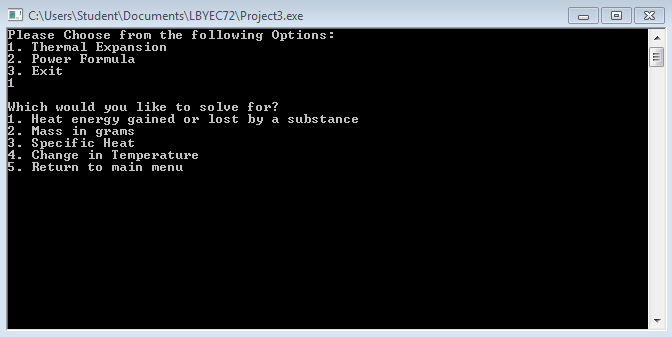
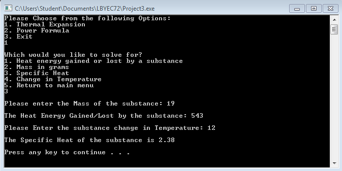
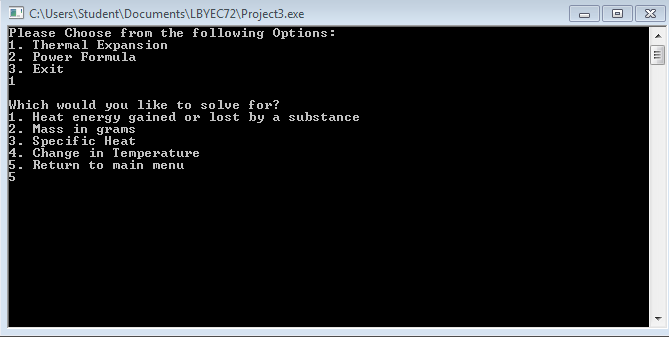
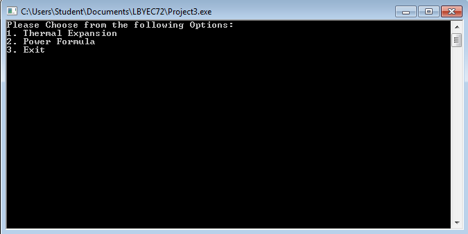
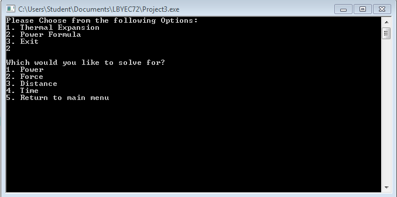
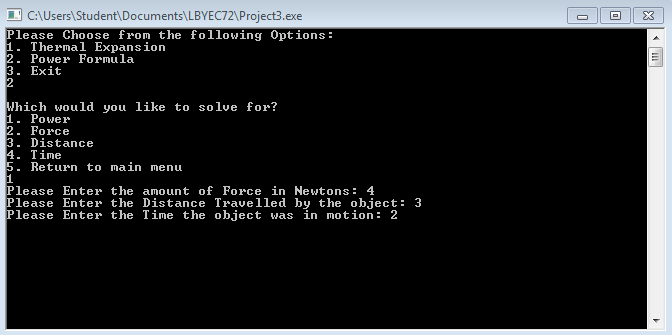

# prelimactivitynumber2-donotincludeanycode-KenBatak
prelimactivitynumber2-donotincludeanycode-KenBatak created by GitHub Classroom

The Basic Menu and Menu1

One of the Inputs for Menu1 including the Result

Choosing option 5 in menu1 and menu 2 clears everything and returns to Basic Menu

More Options for Menu2

Inputs and Outputs of Menu2

